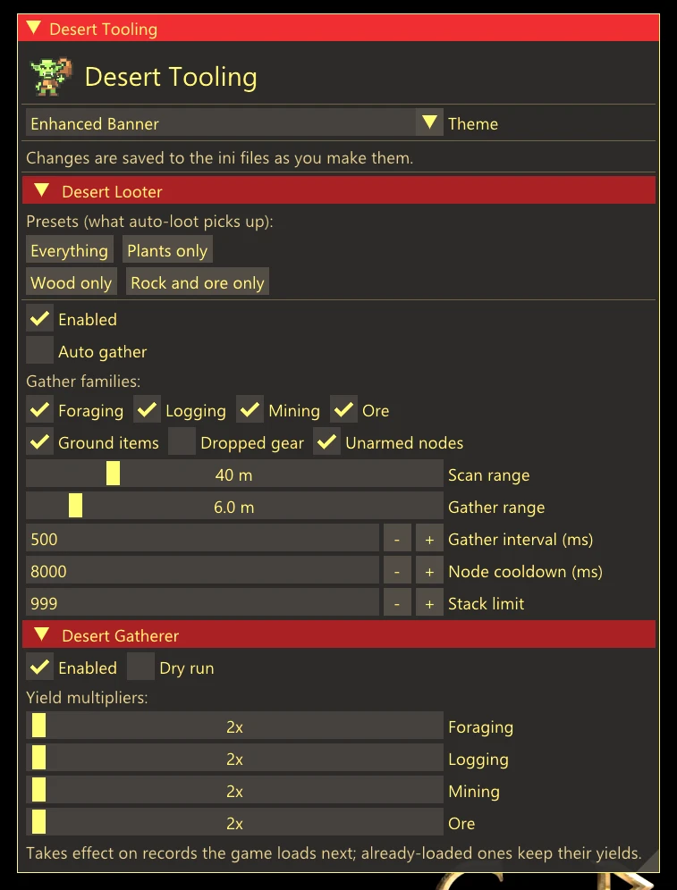

# Crimson Desert mods

Cargo workspace for my [Crimson Desert
Enhanced](https://store.steampowered.com/) mods (Steam build 25116796). They
load as `.asi` plugins through [Ultimate ASI
Loader](https://github.com/ThirteenAG/Ultimate-ASI-Loader) (`winmm.dll` in the
game's `bin64`).

<br clear="left">

<p align="center">
  
</p>

<p align="center"><em>The in-game menu (Desert Overlay, <code>Insert</code>): every setting of both mods, saved to the ini files as you change them.</em></p>

| Mod | Version | What it does |
| --- | --- | --- |
| [desert-looter](desert-looter) | 0.1.1 | Auto-loot for gathering nodes |
| [desert-gatherer](desert-gatherer) | 0.1.1 | Gathering yield multiplier |
| [desert-overlay](desert-overlay) | 0.1.0 | In-game settings menu for the other two |

Also here: [`desert-core/`](desert-core), the shared library the plugins link
(logging, safe memory reads, hooks, PE/pattern scanning), and
[`desert-gatherer-dmm/`](desert-gatherer-dmm), the older offset-patch version
of Gatherer for people on Definitive Mod Manager without an ASI loader. Never
mount it alongside the plugin.

## Install

Grab the zips from a release, or build them yourself, then copy the `.asi` and
its `.ini` into the game's `bin64`.

Editing Gatherer's multipliers from the in-game menu takes effect on the
**next gather**, not the next game start: the game still reads its whole
gather table once, about nine seconds after launch, but the plugin now
rewrites the records it already loaded right after the ini change is picked
up. How, and what the log shows:
<https://github.com/KiefBC/desert-modding/blob/main/desert-gatherer/README.md#how-a-changed-multiplier-becomes-live>.

The Looter and Gatherer zips also carry `DesertOverlay.asi` and its ini, so
either mod on its own brings the in-game menu with it (`Insert` opens it). Both
ship the same file and one copy in `bin64` serves both; the overlay's own zip
is its canonical release. Each mod zip otherwise holds only its own `.asi`,
`.ini`, README and CHANGELOG, flat at the archive root.

## Build

Developed on NixOS; the flake provides the Rust toolchain and the Windows
cross-compiler.

```bash
nix develop
cargo build --release
```

Outputs `desert_looter.dll`, `desert_gatherer.dll` and `desert_overlay.dll`
under `target/x86_64-pc-windows-gnu/release/`. The game loads them as
`DesertLooter.asi`, `DesertGatherer.asi` and `DesertOverlay.asi`; `just install`
copies them into `bin64` under those names, and `just dist` packs them into the
release zips.

The `justfile` wraps the common tasks; run `just` to list them.

## Rules every plugin follows

1. **Never panic**: `panic = "abort"` is set, so a panic is a crash to
   desktop. Clippy denies `unwrap`, `expect`, unchecked indexing, `panic!` and
   friends in shipped code.
2. **Never dereference game memory**: all foreign reads go through
   `desert_core::safe`, and no pointer is cached across frames.
3. **Only run inside `CrimsonDesert.exe`**: the loader also pulls plugins into
   `crashpad_handler.exe`; bail out of `DllMain` there.
4. **No file I/O in `DllMain`**: the loader lock is held; work happens on a
   thread the plugin starts.

## More

[`VERSIONING.md`](VERSIONING.md) covers the versioning scheme and release
procedure. Changelogs: [desert-looter](desert-looter/CHANGELOG.md),
[desert-gatherer](desert-gatherer/CHANGELOG.md).

## License

MIT ([`LICENSE`](LICENSE)). Fork it, take pieces of it, ship your own version.
Keep the copyright notice with the source and you have met the only condition.
